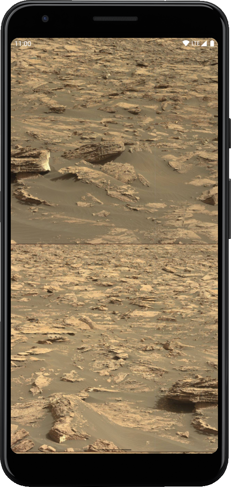
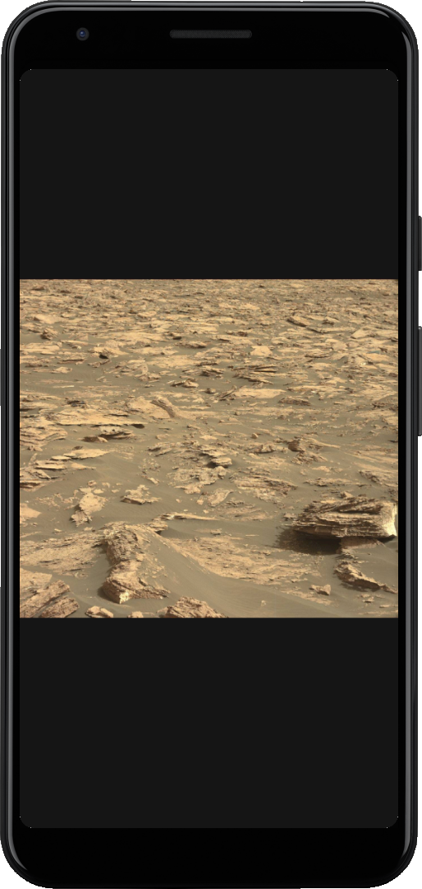

## Mars Images

A very simple app that displays a list of images
taken by the Curiosity rover on Mars.

If you want, you can change the app to display images
from other rovers (see `NasaRemoteConfig` object).

### Screenshots

### Setup project

The app uses NASA API as a backend, so you need to specify an API key in `local.properties` (`nasa_api_key` property).

You can get a key [here](https://api.nasa.gov/),
or you can use `DEMO_KEY` which is limited to:
- Hourly Limit: 30 requests per IP address per hour
- Daily Limit: 50 requests per IP address per day
